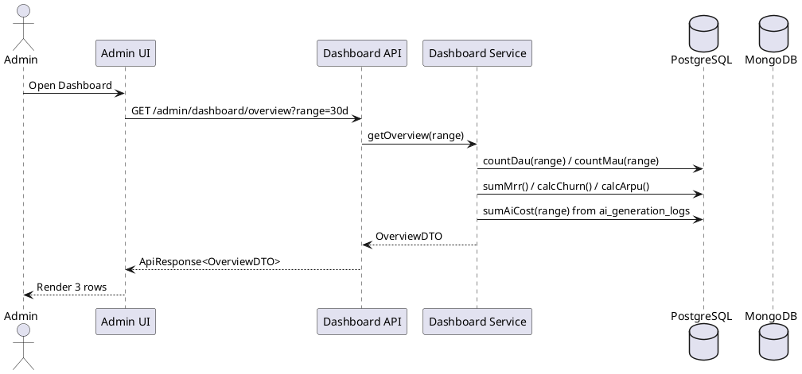

# Admin Dashboard Planning — UML Diagram Studio (v3 — Consolidated)

> **Status:** Final plan (post 2 feedback rounds) | **Last updated:** 2026-07-08 | **Owner:** BE Team

---

## 1. Context

### Current State (verified post-merge)

**Đã có (real):**
- 3 dashboard endpoints: `users`, `projects`, `diagrams` (count + delta + 12-pt sparkline).
- `User.lastActiveAt`, `User.currentSubscription` (FK), `User.status` → đủ tính DAU/MAU/Churn.
- Entities: `PaymentTransaction`, `Subscription`, `Plan` (Plan.price vẫn `Double`).
- AI/AnythingLLM admin suite đã wired (LLM Provider, Workspace, Documents tab).
- Audit log system đầy đủ (controller/service/aspect) — FE tab `audit-logs` vẫn placeholder.

**Chưa có (cần build):**
- `ai_generation_logs`, `provider_rates`, `notifications`, `plan_features` (`model_alias_map` tùy chọn).
- Token/cost logging trong chat flow.
- DAU/MAU/MRR/Churn/ARPU/Margin, AI metrics aggregate.
- SSE, Notification UI, charts (recharts), Power-user tables.
- `Plan` BigDecimal migration + `color`/`popular`/`status` fields.

**FE hardcoded (phải fix):** `storageUsed = projects*0.15`, trend `"+100%"`, System Health (load 12 / latency 45ms), notification badge `2`, bug `activeSubscribers` (chỉ count page size=1).

### Goals
1. **Phase 1 (Core):** AI cost logging + SaaS-vital overview (DAU/MAU/MRR/Churn/ARPU/Margin) + AI usage metrics + fix FE hardcoded.
2. **Phase 2 (Real-time + Power Users):** SSE + Notification + Top Cost Drivers / Top Projects tables + price CRUD UI.
3. **Phase 3 (Advanced):** Feature flags (plan_features), Anomaly detection, Price auto-sync cronjob.

---

## 2. Architecture Decision Records (REVISED)

### ADR-001: AI Token Counting
Ưu tiên đọc token từ provider response → fallback `jtokkit` → fallback `chars/4`.
Lưu thêm `estimation_method` (`PROVIDER` | `JTOKKIT` | `CHARS4`), **không chỉ** `is_estimated` boolean.

### ADR-002: Privacy-First Logging
Log: `user_id_hash`, `timestamp`, `model_name`, `provider`, `token_count`, `latency_ms`, `success`, `error_type`.
**Không log:** `prompt_text`, `response_text`, project name, business logic.

### ADR-003 (REVISED): Cost — Denormalize + Per-Model + Robust
- **Cost tính tại write-time** → lưu `cost_usd DECIMAL(10,6)` vào `ai_generation_logs`.
  Bỏ JOIN versioning (`provider_rates` chỉ lưu current rate, **không** `effective_from/to`).
  → Dashboard chỉ `SUM(cost_usd)` — nhanh, historical bất biến.
- **Giải Retroactive Bug (tính giá hồi tố):** Tại T1 ghi chết `$10` vào `cost_usd`
  (sự thật lịch sử bất biến). Tại T2 giá nguồn tăng → chỉ ảnh hưởng log T2+, T1 không đổi.
  `SUM(cost_usd)` luôn chuẩn → **SaaS Margin không bị phá**.
- **Giá theo MODEL**, không theo provider. `provider_rates` key = `(provider, model_name)`.
- **Cache:** current rate lưu Redis; `updateProviderRate()` PHẢI `@CacheEvict` key tương ứng.
- **Zero-cost loophole:** model không có trong `provider_rates` → vẫn lưu `cost_usd=0`
  (không block user) **NHƯNG** bắn SSE Notification WARNING:
  *"Unrecognized model [x] used. Cost not recorded. Please update pricing."*
  → SaaS Margin không bị fake.
- **Model Source of Truth (sửa lại):** chat response (`/v1/workspace/{slug}/chat`) KHÔNG trả
  model (chỉ `textResponse`/`sources`/`error` — đã verify thực tế: trả HTTP 400, không có field model).
  Do đó model lấy từ **config admin set** (Intelligence tab → AnythingLLM), đọc qua:
  - Ưu tiên `GET /v1/workspace/{slug}` → `chatModel`
  - Fallback `GET /v1/system` → `LLMModel`
  **KHÔNG** đọc từ `.env` (`ANYTHING_LLM_MODEL_NAME` đã stale: `gemma3:4b` ≠ `gemma4:e2b` thực tế).
  Cache vào `SystemConfig` (ADR-005). `model_alias_map` hạ xuống **tùy chọn**.

### ADR-004: Time-series Storage
PostgreSQL + materialized view. (ClickHouse nếu volume lớn — tương lai).

### ADR-005 (NEW): Provider/Model Source of Truth
- Model name = config admin set ở Intelligence tab, đọc từ AnythingLLM:
  ưu tiên workspace `chatModel`, fallback system `LLMModel` (`/v1/system`).
- Khi admin save config (`AiServiceImpl.updateSystemConfig`), BE cache `(provider, model)`
  vào `SystemConfig` entity + refresh định kỳ.
- Logging dùng `SystemConfig.currentModel` làm key tra `provider_rates`.
- Với cloud qua OpenRouter: ID trả về là **canonical** (`anthropic/claude-3.5-sonnet`,
  `google/gemma-2-9b-it`) → khớp thẳng `provider_rates` key → **không cần alias**.
  `model_alias_map` chỉ dùng khi workspace bị set alias lạ.

### ADR-006 (NEW): Price Automation qua OpenRouter
Cronjob (tuần/tháng) đồng bộ giá chuẩn theo flow:
1. `SELECT provider, model_name FROM provider_rates` → tập model hệ thống đang kinh doanh.
2. `GET https://openrouter.ai/api/v1/models` → JSON 200+ models.
3. **Lọc trên RAM** (Java Stream): giữ ID khớp bước 1, bỏ phần còn lại → DB không nhiễm model rác.
4. `UPSERT` giá (rate_in/rate_out per 1k) cho model đã lọc.
5. OpenRouter ID chuẩn → khớp thẳng `provider_rates` key → không cần alias.
→ Cloud provider (Groq/OpenAI/OpenRouter) tự động có giá chuẩn; local Ollama = $0. Admin không gõ tay.

---

## 3. SaaS KPIs (thay vanity metrics)

| Chỉ số | Công thức | Nguồn |
|---|---|---|
| **DAU** | `COUNT(users WHERE last_active_at >= now-24h)` | `User.lastActiveAt` |
| **MAU** | `COUNT(users WHERE last_active_at >= now-30d)` | `User.lastActiveAt` |
| **MRR** | `SUM(plan.price) FROM subscriptions WHERE status='ACTIVE'` | `Subscription`+`Plan` |
| **Churn Rate** | `subscriptions EXPIRED/CANCELLED trong tháng / active đầu tháng` | `Subscription.status`+`endDate` |
| **ARPU** | `MRR / COUNT(users WHERE status='ACTIVE')` | — |
| **SaaS Margin** | `MRR - SUM(cost_usd AI trong tháng)` | dashboard computed |
| **AI Cost** | `SUM(cost_usd)` từ `ai_generation_logs` | denormalized |

---

## 4. Feature Specifications

### 4.1 Dashboard Overview

`GET /admin/dashboard/overview?range={24h|7d|30d|custom}&from=&to=`



**Response:** `{ users:{dau,mau,total}, revenue:{mrr,churn,arpu,margin}, ai:{requests,tokens,avgLatency,cost,errorRate} }`

### 4.2 AI Usage Metrics

`GET /admin/dashboard/ai-metrics?range=30d`
→ requests, totalTokens, avgLatency, errorRate, cost (`SUM(cost_usd)`), cost-by-day split theo provider.

### 4.3 Power Users (Phase 2)

- `GET /admin/dashboard/top-cost-drivers?limit=5` → top users by `SUM(cost_usd)`
- `GET /admin/dashboard/top-projects?limit=5` → top projects by diagram count

### 4.4 Notification + SSE (Phase 2)

**Schema:**
```sql
CREATE TABLE notifications (
    id UUID PRIMARY KEY,
    recipient_id UUID REFERENCES users(id),
    type VARCHAR(50),            -- 'COST_SPIKE','UNRECOGNIZED_MODEL','ABUSE_DETECTED','SYSTEM_ALERT'
    title VARCHAR(200),
    message TEXT,
    severity VARCHAR(20),        -- 'INFO','WARNING','CRITICAL'
    is_read BOOLEAN DEFAULT false,
    related_entity_type VARCHAR(50),
    related_entity_id UUID,
    created_at TIMESTAMP,
    read_at TIMESTAMP
);
```

**Endpoints:**
```
GET    /admin/dashboard/events          (SSE, text/event-stream, Redis Pub/Sub)
GET    /admin/notifications?type=&severity=&isRead=&page=&size=
PATCH  /admin/notifications/{id}/read
PATCH  /admin/notifications/read-all
```

**Rate limit:** 1 alert/type/hour; **CRITICAL = 15 phút**.

### 4.5 Feature Flags (Phase 3)

`Plan` mở rộng: thêm `color`, `popular`, `status`, `yearlyBilling`, `yearlyDiscount`.
`PlanFeature` entity + `plan_features` (MAX_PROJECTS, MAX_DIAGRAMS, AI_QUERIES, MAX_COLLABORATORS).
**KHÔNG grandfathering** — đổi plan → map ngay plan_features mới.
CRUD API cho admin.

### 4.6 Anomaly Detection (Phase 3)

Scheduler mỗi phút: cost spike >200% baseline (CRITICAL 15min), error rate >15%, abuse 3x baseline → Notification.

### 4.7 Price Sync (Phase 3)

Cronjob OpenRouter/LiteLLM public API → upsert `provider_rates`.

### 4.8 AI Generation Logs (Phase 1)

```sql
CREATE TABLE ai_generation_logs (
    id UUID PRIMARY KEY,
    user_id_hash VARCHAR(64),
    session_id VARCHAR(255),
    provider VARCHAR(50),
    model_name VARCHAR(100),
    input_tokens INTEGER,
    output_tokens INTEGER,
    estimation_method VARCHAR(20),     -- 'PROVIDER' | 'JTOKKIT' | 'CHARS4'
    cost_usd DECIMAL(10,6),            -- tính tại write-time
    latency_ms BIGINT,
    success BOOLEAN,
    error_type VARCHAR(50),
    diagram_type VARCHAR(50),
    retry_count INTEGER DEFAULT 0,
    created_at TIMESTAMP NOT NULL
);

CREATE TABLE provider_rates (
    id UUID PRIMARY KEY,
    provider VARCHAR(50) NOT NULL,
    model_name VARCHAR(100) NOT NULL,
    rate_in_per_1k DECIMAL(10,6),
    rate_out_per_1k DECIMAL(10,6),
    currency VARCHAR(3) DEFAULT 'USD',
    UNIQUE(provider, model_name)
);

CREATE TABLE model_alias_map (
    id UUID PRIMARY KEY,
    alias VARCHAR(200) NOT NULL,
    canonical_provider VARCHAR(50) NOT NULL,
    canonical_model VARCHAR(100) NOT NULL,
    UNIQUE(alias)
);

CREATE TABLE system_config (
    id UUID PRIMARY KEY,
    current_provider VARCHAR(50),
    current_model VARCHAR(100),
    updated_at TIMESTAMP
);
```

---

## 5. UI Structure (3 rows)

```
HÀNG 1 (Thẻ số):  MRR | Churn Rate | DAU / Tổng Users | Lợi nhuận ước tính (MRR - AI Cost)
HÀNG 2 (Biểu đồ): API Latency & Error Rate (line) | Chi phí AI theo ngày (bar, split màu Groq/OpenAI/Ollama)
HÀNG 3 (Bảng):    Top 5 Users by AI Cost | Top 5 Projects by Diagram | Real-time Notification (SSE)
```

FE:
- Bỏ hardcoded (storage/trend/system health).
- Thêm `recharts` (line/bar).
- Thêm `adminMetricsService` gọi endpoints overview/ai-metrics.
- Sửa bug `activeSubscribers` (dùng tổng count, không count page size=1).
- Implement `audit-logs` / `user-activity` / `system-settings` tabs (BE đã có API audit).

---

## 6. Phased Task List (27 tasks)

**Phase 1 (HIGH):**
1. PRE-REQ: xác nhận `/v1/system LLMModel` + workspace `chatModel` trả tên model chuẩn (đã verify: `gemma4:e2b`). Không đọc từ chat response.
2. `AnythingLlmChatResponse` + `chat()` capture model field từ chat payload (optional, để cross-check).
3. `AiGenerationLog` entity (`cost_usd`, `estimation_method`, provider/model/tokens/latency…).
4. `ProviderRate` entity (per-model granularity) + Redis cache.
5. `ModelAliasMap` entity + mapping logic (alias ↔ canonical) — **TÙY CHỌN**, chỉ khi workspace set alias lạ.
6. `DataInitializer` seed `provider_rates` chi tiết từng model (Groq/OpenAI/Anthropic/Google/DeepSeek; Ollama=$0).
7. `SystemConfig` lưu provider/model từ `/v1/system LLMModel` (ưu tiên workspace chatModel) khi admin save config.
8. `DiagramChatServiceImpl` ghi `AiGenerationLog` (tính cost_usd từ `SystemConfig.currentModel`, model lạ→alert).
9. Unknown-model flow → `cost_usd=0` + bắn SSE Notification WARNING "Unrecognized model".
10. `updateProviderRate()` MUST `@CacheEvict` Redis key.
11. `DashboardService` overview (DAU/MAU/MRR/Churn/ARPU/Margin).
12. `DashboardService` AI metrics (SUM cost_usd, requests, tokens, avg latency, error rate).
13. `DashboardController` endpoints overview + ai-metrics.
14. FE: fix AnalyticsTab hardcoded + sửa bug `activeSubscribers`.
15. FE: `adminMetricsService` + gọi endpoints overview/ai-metrics.
16. FE: `recharts` — latency/error line + cost-by-day split provider.

**Phase 2 (MEDIUM):**
17. Top Cost Drivers + Top Projects queries.
18. `Notification` entity + bảng `notifications`.
19. SSE endpoint `GET /admin/dashboard/events` + Redis Pub/Sub.
20. Notification CRUD API (CRITICAL limit 15min).
21. FE: NotificationPanel + SSE client (`EventSource`).
22. FE: Top Cost Drivers / Top Projects tables (hàng 3).
23. FE: implement `audit-logs` / `user-activity` / `system-settings` tabs.

**Phase 3 (LOW/MED):**
24. `Plan.price` → BigDecimal + `PaymentTransaction.amount` (ALTER preserve data hoặc create-drop 1 lần).
25. `Plan` thêm `color`/`popular`/`status`/`yearlyBilling`/`yearlyDiscount`.
26. `PlanFeature` + `plan_features` + CRUD (no grandfathering).
27. Price-sync cronjob + Anomaly scheduler.

---

## 7. Migration Notes

- `Plan.price` DOUBLE→DECIMAL: user chọn `create-drop` (wipe + recreate).
  **Cảnh báo:** mất toàn bộ data thật; `create-drop` còn drop trên shutdown.
  Khuyến nghị chạy 1 lệnh `ALTER TABLE plans ALTER COLUMN price TYPE NUMERIC(10,2)` để preserve data.
  Quyết định cuối do implementer.
- `PaymentTransaction.amount` cũng nên đổi tương tự.

---

## 8. Open Questions (đã chốt)

| Câu hỏi | Quyết định |
|---|---|
| Cost fallback | Giữ luồng provider→jtokkit→chars/4, thêm `estimation_method` |
| Grandfathering | **KHÔNG** — map ngay plan_features mới khi đổi plan |
| Notification rate limit | 1/hour chung, **CRITICAL = 15 phút** |
| Plan.price migration | BigDecimal ngay (`DECIMAL(10,2)`) |
| Alias mapping | **TÙY CHỌN** — OpenRouter ID chuẩn nên thường không cần; chỉ khi workspace alias lạ |
| Provider động | Admin update qua UI; cost denormalize tại write-time; current provider lưu `SystemConfig` |

---

## 9. Risk Assessment (updated)

| Risk | Probability | Impact | Mitigation |
|---|---|---|---|
| Model alias mismatch → cost=0 | Low | High | OpenRouter ID chuẩn + alert; `model_alias_map` tùy chọn |
| Cache stale price | Medium | Medium | `@CacheEvict` trên update |
| BigDecimal migration data loss | Medium | High | Dùng ALTER preserve data |
| SSE connection leak | Medium | High | Timeout 30s, heartbeat, reconnect |
| DB query slow | High | High | Indexes, materialized views, cache 5min |
| Redis failure | Low | High | Fallback to DB query |
| Privacy leak | Low | Critical | Metadata-only, PII scan |
| Notification spam | Medium | Medium | Rate limit 1 alert/type/hour (CRITICAL 15min) |
| Token extraction fails | Medium | Medium | Fallback chain: provider → jtokkit → chars/4 |

---

## 10. Timeline

| Phase | Duration | Deliverables |
|---|---|---|
| Phase 1 | 2-3 tuần | AI cost logging, SaaS overview, AI metrics, FE fix hardcoded + charts |
| Phase 2 | 3-4 tuần | SSE, Notification, Power-user tables, price CRUD UI |
| Phase 3 | 4-6 tuần | Feature flags, Anomaly detection, Price auto-sync |
| **Total** | **9-13 tuần** | Full SaaS-grade admin dashboard |

---

## 11. Success Criteria

- [ ] Dashboard overview loads < 2s.
- [ ] SSE updates real-time without connection drops.
- [ ] Notifications persist and filterable.
- [ ] No PII in logs/metrics.
- [ ] Feature flags dynamic and effective immediately.
- [ ] Anomaly alerts trigger within 1 minute (CRITICAL within 15min).
- [ ] Token count accuracy: ≥ 95% from provider, fallback labeled `estimation_method`.
- [ ] Cost calculation correct per-model; Ollama shows $0; unknown model → alert, không fake Margin.
- [ ] DAU/MAU/MRR/Churn/ARPU/Margin hiển thị đúng (không vanity metric).
- [ ] FE không còn hardcode bất kỳ số liệu nào.
