# Mermaid Use Case Diagram Knowledge Base

Version: Mermaid v11+

---

## Chunk 1: Foundation — Diagram Declaration

### Mục đích
Use Case Diagram biểu diễn **tương tác giữa actor và hệ thống**: ai làm gì, chức năng nào hệ thống cung cấp, và mối quan hệ giữa các use case.

Dùng để mô tả:
- Chức năng hệ thống từ góc nhìn người dùng
- Actor nào tương tác với chức năng nào
- Mối quan hệ include, extend giữa các use case
- Ranh giới hệ thống (system boundary)

### Mermaid keyword

Mermaid dùng keyword:

```
requirementDiagram
```

> ⚠️ **Quan trọng:** Mermaid **không có native Use Case Diagram**. Use Case Diagram được mô phỏng bằng một trong 2 cách:
> - **Cách 1 (Khuyến nghị):** Dùng `flowchart` với style node đặc biệt
> - **Cách 2:** Dùng `graph` với subgraph làm system boundary

### Khai báo bắt buộc — Cách 1 (Flowchart)

```mermaid
flowchart LR
```

> `LR` (Left → Right) là direction phổ biến nhất cho Use Case Diagram vì actor thường nằm hai bên, use case nằm giữa.

### Khai báo bắt buộc — Cách 2 (Graph)

```mermaid
graph LR
```

> `graph` và `flowchart` tương đương, nhưng `flowchart` là cú pháp mới hơn và được khuyến nghị.

### Direction phù hợp cho Use Case

| Direction | Dùng khi |
|-----------|----------|
| `LR` | Actor trái/phải, use case ở giữa (phổ biến nhất) |
| `TD` | Actor trên/dưới, use case ở giữa |
| `TB` | Tương đương `TD` |

### Ví dụ tổng quan

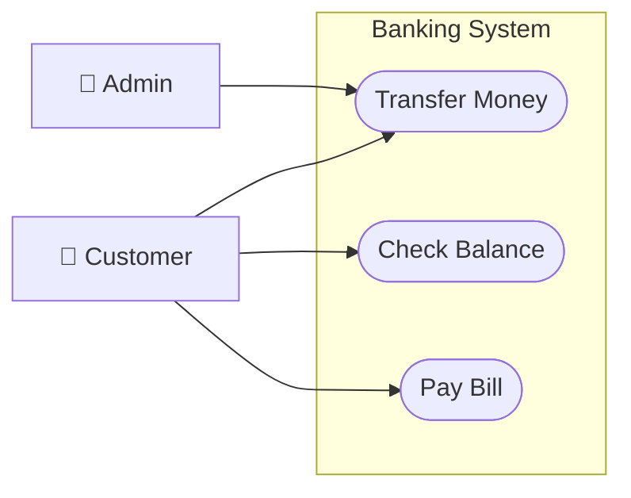

### ❌ Lỗi thường gặp

```
%% SAI — không có direction
flowchart
    Actor --> UseCase

%% SAI — dùng classDiagram cho use case
classDiagram
    Actor --> UseCase

%% SAI — thiếu system boundary
flowchart LR
    Actor --> UC1
    Actor --> UC2
```

### Mapping ngôn ngữ tự nhiên
- "Vẽ use case diagram" → `flowchart LR` + subgraph system boundary
- "Actor bên trái bên phải" → `flowchart LR`
- "Actor trên dưới" → `flowchart TD`
- "Hệ thống ngân hàng / bán hàng..." → tên subgraph system boundary

---

## Chunk 2: Actor — Khai báo và Phân loại

### Actor là gì
Actor là **thực thể bên ngoài** tương tác với hệ thống: người dùng, hệ thống khác, thiết bị, hoặc thời gian (timer).

### Phân loại Actor

| Loại | Mô tả | Ví dụ |
|------|-------|-------|
| Primary Actor | Khởi tạo use case, tương tác trực tiếp | Customer, User, Admin |
| Secondary Actor | Hỗ trợ hệ thống xử lý | Email Service, Payment Gateway |
| System Actor | Hệ thống bên ngoài | External API, Legacy System |

### Khai báo Actor — Các cách

**Cách 1: Hình chữ nhật đơn giản (phổ biến)**

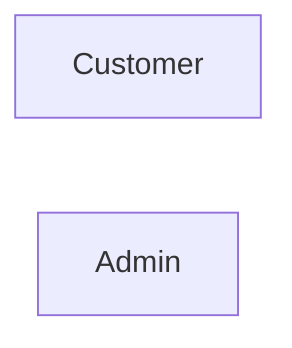

**Cách 2: Dùng emoji người (trực quan hơn)**

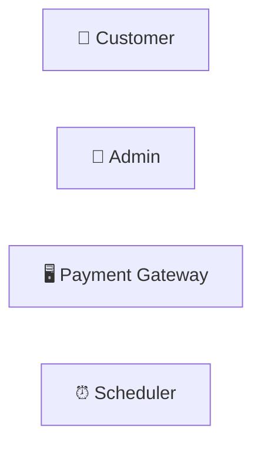

**Cách 3: Dùng hình tròn để phân biệt actor**

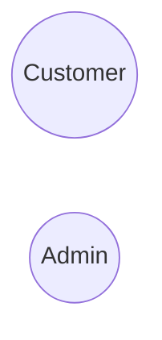

**Cách 4: Style actor như hình người UML (khuyến nghị)**

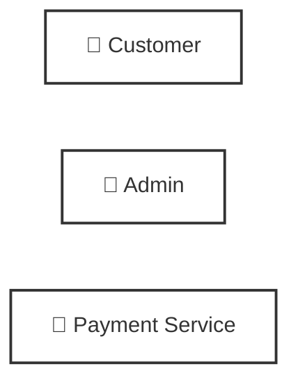

### Primary vs Secondary Actor

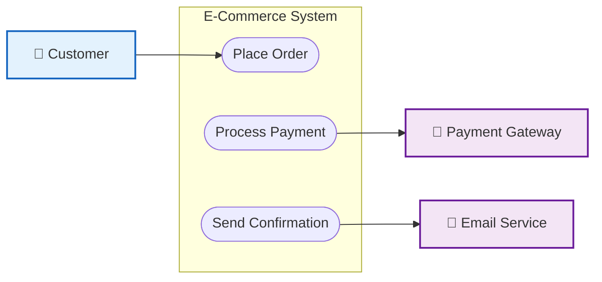

### Vị trí Actor

- **Primary Actor**: Bên **trái** hệ thống (khởi tạo)
- **Secondary Actor**: Bên **phải** hệ thống (hỗ trợ)

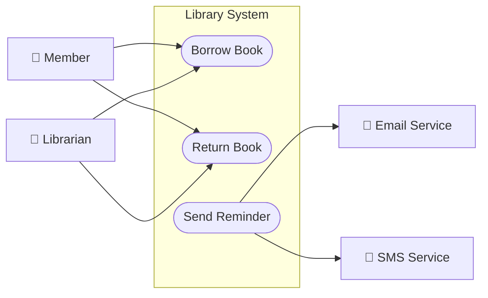

### Quy tắc đặt tên Actor
- Dùng **danh từ / vai trò**: `Customer`, `Admin`, `Manager`
- **Không dùng** động từ: ~~`Login`~~, ~~`Buying`~~
- Tên có space dùng **label**: `SUPER_ADMIN[Super Admin]`
- Actor ID dùng **UPPER_SNAKE_CASE**: `CUSTOMER`, `PAYMENT_GW`

### ❌ Lỗi thường gặp

```
%% SAI — Actor ID có space
flowchart LR
    Super Admin --> UC1([Login])

%% SAI — Actor dùng động từ
flowchart LR
    Buying[Buying] --> UC1([Place Order])

%% SAI — Primary và Secondary cùng bên
flowchart LR
    subgraph System["System"]
        UC1([Order])
    end
    CUSTOMER[Customer] --> UC1
    EMAIL[Email] --> UC1
```

### Mapping ngôn ngữ tự nhiên
- "Người dùng / khách hàng" → `CUSTOMER[👤 Customer]`
- "Quản trị viên" → `ADMIN[👤 Admin]`
- "Hệ thống thanh toán bên ngoài" → `PAYMENT[🔧 Payment Gateway]` (secondary, bên phải)
- "Hệ thống gửi email" → `EMAIL[📧 Email Service]` (secondary, bên phải)
- "Người quản lý" → `MANAGER[👤 Manager]`
- "Hệ thống định kỳ / scheduler" → `TIMER[⏰ Scheduler]`

---

## Chunk 3: Use Case — Khai báo và Đặt tên

### Use Case là gì
Use Case là **chức năng** mà hệ thống cung cấp cho actor. Biểu diễn bằng hình **ellipse (oval)** trong UML.

### Khai báo Use Case

**Cách 1: Dùng hình ellipse `([ ])` — Khuyến nghị**

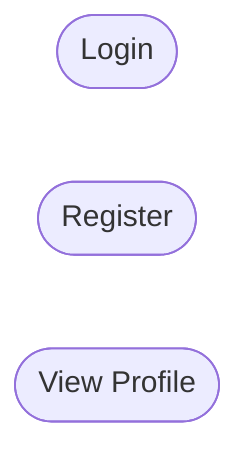

**Cách 2: Dùng hình tròn `(( ))`**

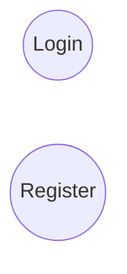

> `([...])` trông giống ellipse UML hơn, khuyến nghị dùng.

### Use Case phải nằm trong System Boundary

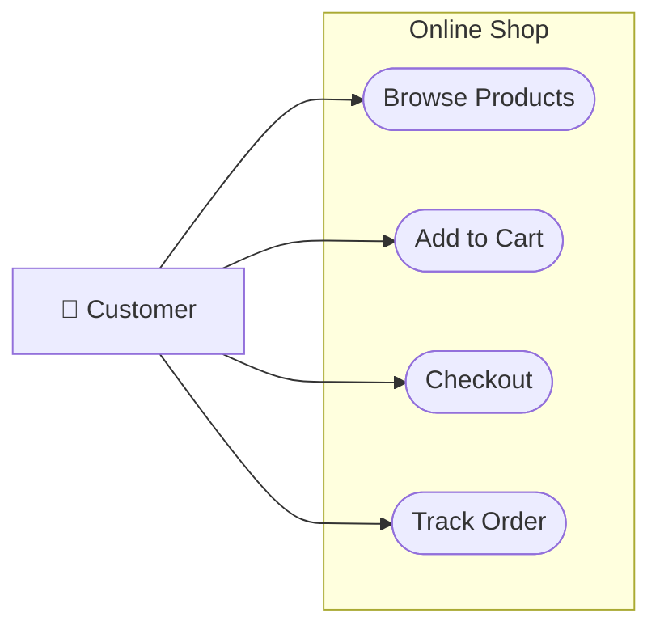

### Quy tắc đặt tên Use Case

- Dùng **động từ + danh từ (cụm động từ)**: `Login`, `Place Order`, `Generate Report`
- **Không dùng danh từ đơn**: ~~`Login Form`~~, ~~`Order`~~
- **Không dùng tên kỹ thuật**: ~~`POST /api/login`~~, ~~`callDatabase()`~~
- Dùng **ngôn ngữ của người dùng**, không phải lập trình viên

| ❌ Sai | ✅ Đúng |
|--------|---------|
| `User Authentication` | `Login` |
| `Order CRUD` | `Place Order`, `View Order`, `Cancel Order` |
| `sendEmail()` | `Send Notification` |
| `DB Query` | `Search Products` |

### Use Case ID — Quy tắc

- Dùng **UPPER_SNAKE_CASE** hoặc viết tắt: `UC_LOGIN`, `UC1`, `LOGIN`
- Không trùng nhau trong diagram
- Không chứa space

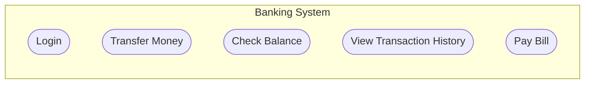

### Nhóm Use Case liên quan (Nested subgraph)

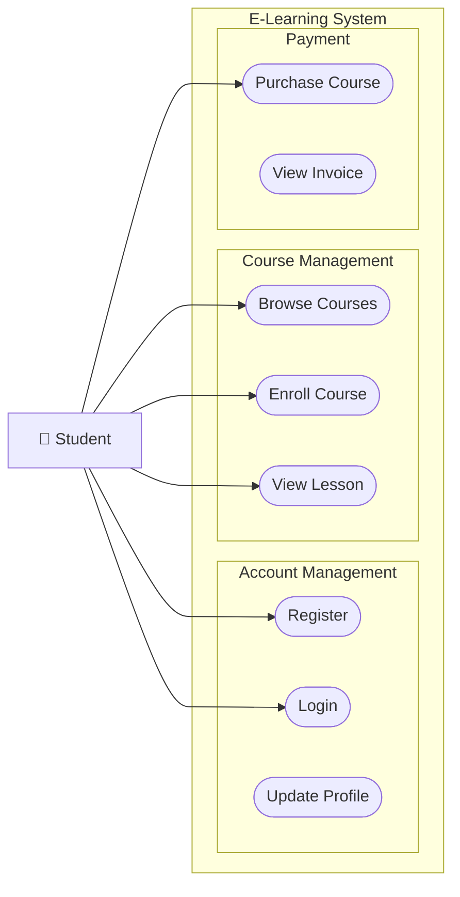

### ❌ Lỗi thường gặp

```
%% SAI — Use case nằm ngoài system boundary
flowchart LR
    subgraph System["System"]
        UC1([Login])
    end
    UC2([Register])
    CUSTOMER[Customer] --> UC2

%% SAI — Use case dùng tên kỹ thuật
flowchart LR
    subgraph System["System"]
        UC1([POST /api/auth/login])
    end

%% SAI — Use case ID trùng nhau
flowchart LR
    subgraph System["System"]
        UC1([Login])
        UC1([Register])
    end
```

### Mapping ngôn ngữ tự nhiên
- "Chức năng đăng nhập" → `([Login])`
- "Chức năng đặt hàng" → `([Place Order])`
- "Xem danh sách" → `([View ... List])`
- "Quản lý X" → tách thành `([Add X])`, `([Edit X])`, `([Delete X])`, `([View X])`
- "Tạo báo cáo" → `([Generate Report])`
- "Nhóm các chức năng tài khoản" → nested subgraph

---

## Chunk 4: System Boundary — Ranh giới hệ thống

### System Boundary là gì
System Boundary là **đường bao** xác định phạm vi của hệ thống. Mọi use case phải nằm bên trong. Actor nằm bên ngoài.

### Khai báo bằng subgraph

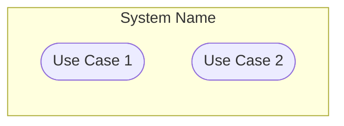

### System Boundary với style

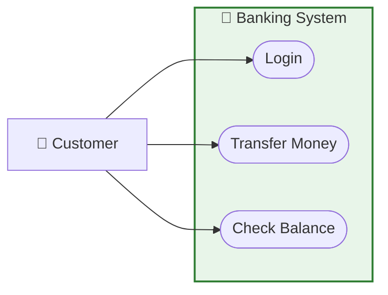

### Nhiều System Boundary trong 1 diagram

Dùng khi diagram mô tả **nhiều hệ thống** tương tác nhau.

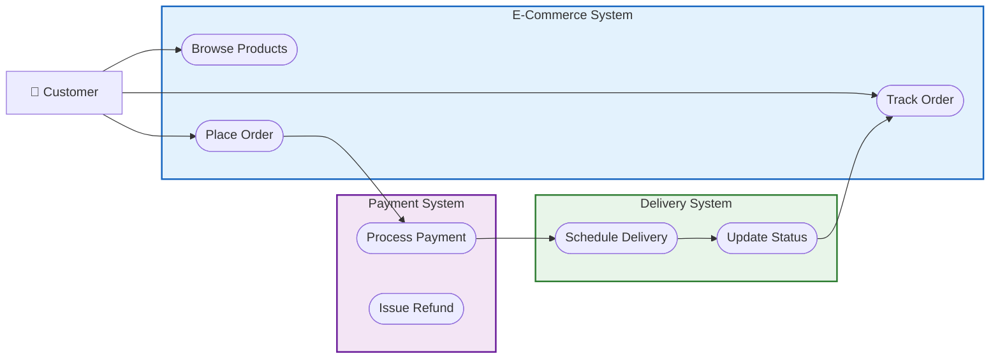

### System Boundary với nhóm con

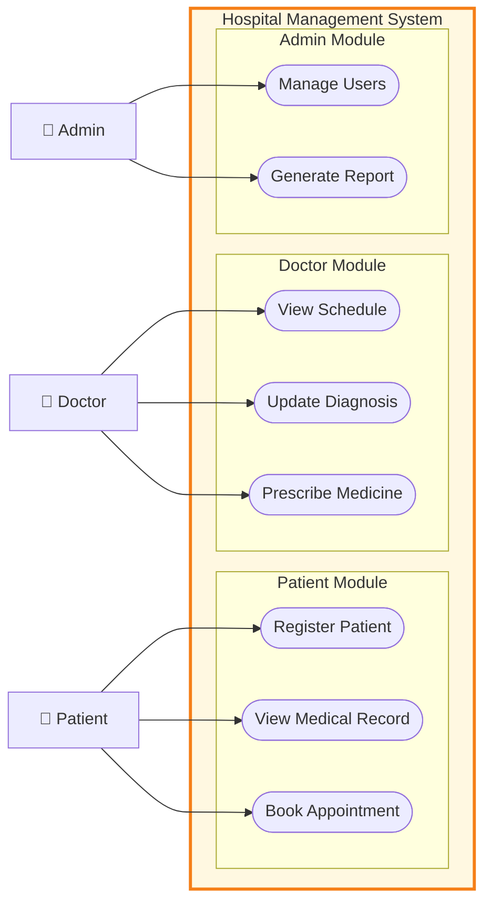

### Quy tắc System Boundary
- Tên boundary là **tên hệ thống**: `Banking System`, `E-Commerce Platform`
- **Không đặt actor** trong boundary
- Tất cả use case **phải trong** boundary
- Boundary có thể **lồng nhau** (module lớn chứa module nhỏ)

### ❌ Lỗi thường gặp

```
%% SAI — Actor trong system boundary
flowchart LR
    subgraph System["System"]
        CUSTOMER[Customer]
        UC1([Login])
    end

%% SAI — Use case ngoài boundary
flowchart LR
    subgraph System["System"]
        UC1([Login])
    end
    UC2([Register])

%% SAI — Boundary không có tên
flowchart LR
    subgraph
        UC1([Login])
    end
```

### Mapping ngôn ngữ tự nhiên
- "Hệ thống X" → `subgraph SYS["X System"]`
- "Module quản lý Y" → nested subgraph `subgraph Y["Y Management"]`
- "Ranh giới hệ thống" → subgraph bao ngoài tất cả use case
- "Tô màu phân biệt hệ thống" → `style SYS fill:#color,stroke:#color`

---

## Chunk 5: Actor — Use Case Relationship (Association)

### Association là gì
Association là **đường kết nối** giữa actor và use case, thể hiện actor **tham gia** vào use case đó.

### Cú pháp cơ bản

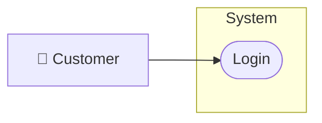

### Một actor — Nhiều use case

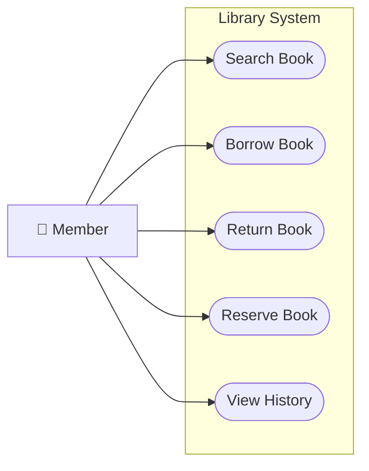

### Nhiều actor — Cùng use case

```mermaid
flowchart LR
    subgraph SYS["HR System"]
        UC1([View Payslip])
        UC2([Approve Leave])
        UC3([Manage Employee])
        UC4([Generate Report])
    end

    EMPLOYEE[👤 Employee]
    MANAGER[👤 Manager]
    HR[👤 HR Staff]
    ADMIN[👤 Admin]

    EMPLOYEE --> UC1
    MANAGER --> UC1
    MANAGER --> UC2
    HR --> UC2
    HR --> UC3
    ADMIN --> UC3
    ADMIN --> UC4
    HR --> UC4
```

### Actor kế thừa (Actor Generalization)

Actor con **kế thừa** tất cả use case của actor cha.

```mermaid
flowchart LR
    subgraph SYS["E-Commerce System"]
        UC1([Browse Products])
        UC2([Add to Cart])
        UC3([Place Order])
        UC4([Manage Products])
        UC5([View All Orders])
        UC6([Manage Users])
    end

    USER[👤 User]
    CUSTOMER[👤 Customer]
    ADMIN[👤 Admin]
    SUPER_ADMIN[👤 Super Admin]

    %% Inheritance giữa actor
    CUSTOMER -.->|extends| USER
    ADMIN -.->|extends| USER

    %% Use case của từng actor
    USER --> UC1
    CUSTOMER --> UC2
    CUSTOMER --> UC3
    ADMIN --> UC4
    ADMIN --> UC5
    SUPER_ADMIN --> UC6
    SUPER_ADMIN -.->|extends| ADMIN
```

### Actor với hệ thống ngoài (System Actor)

```mermaid
flowchart LR
    subgraph SYS["Order Management System"]
        UC1([Place Order])
        UC2([Process Payment])
        UC3([Send Confirmation])
        UC4([Update Inventory])
    end

    %% Primary — trái
    CUSTOMER[👤 Customer]

    %% Secondary — phải
    PAYMENT_GW[🔧 Payment Gateway]
    EMAIL_SVC[📧 Email Service]
    INVENTORY[🗄️ Inventory System]

    CUSTOMER --> UC1
    CUSTOMER --> UC2
    UC2 --> PAYMENT_GW
    UC3 --> EMAIL_SVC
    UC4 --> INVENTORY
```

### ❌ Lỗi thường gặp

```
%% SAI — arrow ngược từ use case vào primary actor
flowchart LR
    subgraph SYS["System"]
        UC1([Login])
    end
    UC1 --> CUSTOMER[Customer]

%% ĐÚNG — primary actor khởi tạo
    CUSTOMER --> UC1

%% SAI — không có association, actor bị cô lập
flowchart LR
    subgraph SYS["System"]
        UC1([Login])
    end
    CUSTOMER[Customer]
    ADMIN[Admin]
    CUSTOMER --> UC1
    %% ADMIN không có use case nào
```

### Mapping ngôn ngữ tự nhiên
- "User có thể đăng nhập" → `USER --> UC_LOGIN`
- "Admin và User đều dùng chức năng X" → cả 2 actor đều có arrow vào X
- "Chỉ Admin mới làm được X" → chỉ `ADMIN --> UC_X`
- "Hệ thống email gửi thông báo" → `UC --> EMAIL_SVC` (secondary, phải)
- "Admin kế thừa quyền của User" → dùng `-.->|extends|`

---

## Chunk 6: Include Relationship

### Include là gì
`<<include>>` nghĩa là use case **bắt buộc gọi** use case khác. Use case được include **luôn luôn được thực thi**.

> Dùng khi: Một chức năng **chia sẻ** bước xử lý chung bắt buộc.

### Ký hiệu

```
UC_A -.->|"<<include>>"| UC_B
```

> Arrow nét đứt `-.->` + label `<<include>>`.

### Ví dụ cơ bản

```mermaid
flowchart LR
    subgraph SYS["Banking System"]
        UC1([Transfer Money])
        UC2([Pay Bill])
        UC3([Check Balance])
        UC_AUTH([Authenticate User])
    end

    CUSTOMER[👤 Customer]

    CUSTOMER --> UC1
    CUSTOMER --> UC2
    CUSTOMER --> UC3

    UC1 -.->|"<<include>>"| UC_AUTH
    UC2 -.->|"<<include>>"| UC_AUTH
    UC3 -.->|"<<include>>"| UC_AUTH
```

> `Transfer Money`, `Pay Bill`, `Check Balance` đều **bắt buộc** phải `Authenticate User` trước.

### Include nhiều cấp

```mermaid
flowchart LR
    subgraph SYS["E-Commerce System"]
        UC1([Place Order])
        UC2([Process Payment])
        UC3([Validate Payment Info])
        UC4([Check Inventory])
        UC_LOGIN([Login])
    end

    CUSTOMER[👤 Customer]
    CUSTOMER --> UC1
    UC1 -.->|"<<include>>"| UC_LOGIN
    UC1 -.->|"<<include>>"| UC4
    UC1 -.->|"<<include>>"| UC2
    UC2 -.->|"<<include>>"| UC3
```

### Include dùng chung (Shared behavior)

```mermaid
flowchart LR
    subgraph SYS["Reporting System"]
        UC1([Generate Sales Report])
        UC2([Generate Inventory Report])
        UC3([Generate User Report])
        UC_AUTH([Authenticate])
        UC_LOG([Log Activity])
        UC_FORMAT([Format Report])
    end

    MANAGER[👤 Manager]
    ADMIN[👤 Admin]

    MANAGER --> UC1
    MANAGER --> UC2
    ADMIN --> UC3
    ADMIN --> UC1

    UC1 -.->|"<<include>>"| UC_AUTH
    UC2 -.->|"<<include>>"| UC_AUTH
    UC3 -.->|"<<include>>"| UC_AUTH

    UC1 -.->|"<<include>>"| UC_LOG
    UC2 -.->|"<<include>>"| UC_LOG
    UC3 -.->|"<<include>>"| UC_LOG

    UC1 -.->|"<<include>>"| UC_FORMAT
    UC2 -.->|"<<include>>"| UC_FORMAT
    UC3 -.->|"<<include>>"| UC_FORMAT
```

### Phân biệt Include vs thông thường

| | Association | Include |
|---|---|---|
| Ai kết nối | Actor → Use Case | Use Case → Use Case |
| Arrow | `-->` (liền) | `-.->` (đứt) |
| Label | Không bắt buộc | `"<<include>>"` |
| Ý nghĩa | "Actor tham gia" | "Bắt buộc gọi" |

### ❌ Lỗi thường gặp

```
%% SAI — include từ actor
flowchart LR
    subgraph SYS["System"]
        UC1([Login])
        UC2([Authenticate])
    end
    ACTOR[Customer] -.->|"<<include>>"| UC2

%% ĐÚNG — include từ use case
    UC1 -.->|"<<include>>"| UC2

%% SAI — dùng arrow liền cho include
flowchart LR
    subgraph SYS["System"]
        UC1([Transfer])
        UC2([Authenticate])
    end
    UC1 -->|"<<include>>"| UC2

%% ĐÚNG
    UC1 -.->|"<<include>>"| UC2

%% SAI — include ngược chiều
flowchart LR
    subgraph SYS["System"]
        UC1([Login])
        UC2([Authenticate])
    end
    UC2 -.->|"<<include>>"| UC1
    %% Ngược: Authenticate include Login — vô nghĩa
```

### Mapping ngôn ngữ tự nhiên
- "Mọi chức năng đều cần đăng nhập trước" → mọi UC include `UC_LOGIN`
- "Bước bắt buộc / luôn luôn phải làm" → `<<include>>`
- "Dùng chung một chức năng" → nhiều UC cùng include 1 UC
- "A bao gồm B" / "A gọi B" → `A -.->|"<<include>>"| B`
- "Xác thực trước khi làm gì" → UC_TARGET include UC_AUTH

---

## Chunk 7: Extend Relationship

### Extend là gì
`<<extend>>` nghĩa là use case **có thể mở rộng** use case khác trong **điều kiện cụ thể**. Use case extend **không phải lúc nào cũng được thực thi**.

> Dùng khi: Một chức năng là **tuỳ chọn** hoặc chỉ xảy ra trong **điều kiện đặc biệt**.

### Ký hiệu

```
UC_EXTEND -.->|"<<extend>>"| UC_BASE
```

> Arrow từ **use case mở rộng** → **use case cơ sở** (ngược với include).

### Ví dụ cơ bản

```mermaid
flowchart LR
    subgraph SYS["Shopping System"]
        UC1([Place Order])
        UC2([Apply Discount Coupon])
        UC3([Add Gift Wrapping])
        UC4([Express Delivery])
    end

    CUSTOMER[👤 Customer]
    CUSTOMER --> UC1

    UC2 -.->|"<<extend>>"| UC1
    UC3 -.->|"<<extend>>"| UC1
    UC4 -.->|"<<extend>>"| UC1
```

> `Apply Discount Coupon`, `Add Gift Wrapping`, `Express Delivery` là tuỳ chọn khi `Place Order`.

### Extend với điều kiện (Extension Point)

```mermaid
flowchart LR
    subgraph SYS["ATM System"]
        UC1([Withdraw Money])
        UC2([Print Receipt])
        UC3([Send SMS Alert])
        UC4([Block Card])
    end

    CUSTOMER[👤 Customer]
    CUSTOMER --> UC1

    UC2 -.->|"<<extend>>\n[if: customer requests]"| UC1
    UC3 -.->|"<<extend>>\n[if: alert enabled]"| UC1
    UC4 -.->|"<<extend>>\n[if: 3 failed attempts]"| UC1
```

### Kết hợp Include và Extend

```mermaid
flowchart LR
    subgraph SYS["Online Banking"]
        UC1([Transfer Money])
        UC2([Authenticate])
        UC3([Validate Account])
        UC4([Send OTP])
        UC5([Schedule Transfer])
        UC6([Notify via Email])
    end

    CUSTOMER[👤 Customer]
    BANK_SYS[🔧 Core Banking]

    CUSTOMER --> UC1
    UC1 -.->|"<<include>>"| UC2
    UC1 -.->|"<<include>>"| UC3
    UC2 -.->|"<<include>>"| UC4
    UC5 -.->|"<<extend>>"| UC1
    UC6 -.->|"<<extend>>"| UC1
    UC1 --> BANK_SYS
```

### Phân biệt Include vs Extend

| | Include | Extend |
|---|---|---|
| Ý nghĩa | Bắt buộc gọi | Tuỳ chọn, có điều kiện |
| Arrow hướng | UC_BASE → UC_INCLUDED | UC_EXTEND → UC_BASE |
| Thực thi | Luôn luôn | Chỉ khi có điều kiện |
| Ví dụ | Login include Authenticate | Place Order extend Apply Coupon |
| Từ khóa | "luôn luôn", "bắt buộc" | "có thể", "tuỳ chọn", "nếu" |

### ❌ Lỗi thường gặp

```
%% SAI — chiều arrow ngược (extend phải từ UC mở rộng → UC cơ sở)
flowchart LR
    subgraph SYS["System"]
        UC1([Place Order])
        UC2([Apply Coupon])
    end
    UC1 -.->|"<<extend>>"| UC2
    %% Đúng phải là: UC2 extend UC1

%% ĐÚNG
    UC2 -.->|"<<extend>>"| UC1

%% SAI — nhầm extend với include
flowchart LR
    subgraph SYS["System"]
        UC1([Login])
        UC2([Remember Me])
    end
    UC1 -.->|"<<include>>"| UC2
    %% Remember Me là tuỳ chọn → phải dùng extend
    %% ĐÚNG: UC2 -.->|"<<extend>>"| UC1

%% SAI — extend từ actor
    CUSTOMER -.->|"<<extend>>"| UC1
```

### Mapping ngôn ngữ tự nhiên
- "Tuỳ chọn" / "Có thể" / "Không bắt buộc" → `<<extend>>`
- "Chỉ khi điều kiện X" → `<<extend>>` với điều kiện trong label
- "Mở rộng chức năng A bằng B" → `B -.->|"<<extend>>"| A`
- "Tính năng thêm" / "Add-on" → `<<extend>>`
- "Nếu người dùng chọn" → `<<extend>>`

---

## Chunk 8: Generalization — Kế thừa Use Case và Actor

### Use Case Generalization
Use case con **kế thừa** và **mở rộng** hành vi của use case cha.

```mermaid
flowchart LR
    subgraph SYS["Payment System"]
        UC_PAY([Pay])
        UC_CARD([Pay by Credit Card])
        UC_PAYPAL([Pay by PayPal])
        UC_BANK([Pay by Bank Transfer])
    end

    CUSTOMER[👤 Customer]
    CUSTOMER --> UC_PAY

    UC_CARD -.->|"<<generalization>>"| UC_PAY
    UC_PAYPAL -.->|"<<generalization>>"| UC_PAY
    UC_BANK -.->|"<<generalization>>"| UC_PAY
```

### Actor Generalization
Actor con **kế thừa** tất cả association của actor cha.

```mermaid
flowchart LR
    subgraph SYS["Content Management System"]
        UC1([View Content])
        UC2([Create Content])
        UC3([Edit Content])
        UC4([Delete Content])
        UC5([Manage Users])
        UC6([System Settings])
    end

    VISITOR[👤 Visitor]
    MEMBER[👤 Member]
    EDITOR[👤 Editor]
    ADMIN[👤 Admin]

    %% Actor generalization
    MEMBER -.->|"<<generalization>>"| VISITOR
    EDITOR -.->|"<<generalization>>"| MEMBER
    ADMIN -.->|"<<generalization>>"| EDITOR

    %% Use cases
    VISITOR --> UC1
    MEMBER --> UC2
    EDITOR --> UC3
    EDITOR --> UC4
    ADMIN --> UC5
    ADMIN --> UC6
```

### Phân biệt Generalization vs Extend vs Include

| | Generalization | Extend | Include |
|---|---|---|---|
| Giữa | UC–UC hoặc Actor–Actor | UC–UC | UC–UC |
| Ý nghĩa | Kế thừa | Mở rộng tuỳ chọn | Gọi bắt buộc |
| Arrow | `-.->|"<<generalization>>"` | `-.->|"<<extend>>"` | `-.->|"<<include>>"` |
| Tương tự | OOP Inheritance | Plugin/Optional feature | Mandatory subroutine |

### ❌ Lỗi thường gặp

```
%% SAI — nhầm generalization với inheritance OOP
flowchart LR
    subgraph SYS["System"]
        UC1([Pay])
        UC2([Pay by Card])
    end
    UC2 --|> UC1
    %% Dùng syntax class diagram — sai

%% ĐÚNG — dùng nét đứt + label
    UC2 -.->|"<<generalization>>"| UC1
```

### Mapping ngôn ngữ tự nhiên
- "Là một loại" (use case) → `<<generalization>>`
- "Admin là User nhưng có thêm quyền" → Actor generalization
- "Có nhiều cách thanh toán" → Pay có nhiều UC con generalization
- "Kế thừa từ" → `<<generalization>>`

---

## Chunk 9: Complete Examples — Common Patterns

### Pattern 1: Authentication System

```mermaid
flowchart LR
    classDef actor fill:#E3F2FD,stroke:#1565C0,stroke-width:2px
    classDef usecase fill:#F9FBE7,stroke:#827717
    classDef system fill:#E8F5E9,stroke:#2E7D32

    subgraph SYS["🔐 Authentication System"]
        UC_REGISTER([Register])
        UC_LOGIN([Login])
        UC_LOGOUT([Logout])
        UC_FORGOT([Forgot Password])
        UC_RESET([Reset Password])
        UC_2FA([Two-Factor Auth])
        UC_VALIDATE([Validate Credentials])
        UC_TOKEN([Generate Token])
        UC_SEND_OTP([Send OTP])
    end

    USER[👤 User]:::actor
    EMAIL_SVC[📧 Email Service]:::actor
    SMS_SVC[📱 SMS Service]:::actor

    USER --> UC_REGISTER
    USER --> UC_LOGIN
    USER --> UC_LOGOUT
    USER --> UC_FORGOT

    UC_LOGIN -.->|"<<include>>"| UC_VALIDATE
    UC_LOGIN -.->|"<<include>>"| UC_TOKEN
    UC_FORGOT -.->|"<<include>>"| UC_RESET
    UC_RESET -.->|"<<include>>"| UC_SEND_OTP

    UC_2FA -.->|"<<extend>>"| UC_LOGIN
    UC_SEND_OTP --> EMAIL_SVC
    UC_SEND_OTP --> SMS_SVC

    style SYS fill:#E8F5E9,stroke:#2E7D32,stroke-width:2px
```

---

### Pattern 2: E-Commerce System

```mermaid
flowchart LR
    subgraph ECOM["🛒 E-Commerce Platform"]
        subgraph Catalog["Product Catalog"]
            UC1([Browse Products])
            UC2([Search Products])
            UC3([View Product Detail])
            UC4([Filter & Sort])
        end

        subgraph Cart["Shopping Cart"]
            UC5([Add to Cart])
            UC6([Update Cart])
            UC7([Remove from Cart])
        end

        subgraph Order["Order Management"]
            UC8([Place Order])
            UC9([Track Order])
            UC10([Cancel Order])
            UC11([Return Order])
        end

        subgraph Payment["Payment"]
            UC12([Process Payment])
            UC13([Apply Coupon])
            UC14([Refund])
        end

        subgraph Admin["Admin Panel"]
            UC15([Manage Products])
            UC16([Manage Orders])
            UC17([Manage Users])
            UC18([View Reports])
        end

        UC_AUTH([Authenticate])
        UC_NOTIFY([Send Notification])
    end

    CUSTOMER[👤 Customer]
    ADMIN_USER[👤 Admin]
    PAYMENT_GW[🔧 Payment Gateway]
    EMAIL[📧 Email Service]

    CUSTOMER --> UC1
    CUSTOMER --> UC2
    CUSTOMER --> UC3
    CUSTOMER --> UC5
    CUSTOMER --> UC8
    CUSTOMER --> UC9
    CUSTOMER --> UC10

    ADMIN_USER --> UC15
    ADMIN_USER --> UC16
    ADMIN_USER --> UC17
    ADMIN_USER --> UC18

    UC8 -.->|"<<include>>"| UC_AUTH
    UC8 -.->|"<<include>>"| UC12
    UC12 -.->|"<<include>>"| UC_AUTH
    UC2 -.->|"<<include>>"| UC4

    UC13 -.->|"<<extend>>"| UC8
    UC11 -.->|"<<extend>>"| UC10
    UC14 -.->|"<<extend>>"| UC12

    UC12 --> PAYMENT_GW
    UC_NOTIFY --> EMAIL

    style ECOM fill:#FFF8E1,stroke:#F57F17,stroke-width:2px
```

---

### Pattern 3: Hospital Management System (Swimlane Style)

```mermaid
flowchart LR
    subgraph HMS["🏥 Hospital Management System"]
        subgraph PatientMod["Patient Module"]
            UC1([Register Patient])
            UC2([Book Appointment])
            UC3([View Medical Record])
            UC4([Pay Medical Bill])
        end

        subgraph DoctorMod["Doctor Module"]
            UC5([View Patient List])
            UC6([Update Diagnosis])
            UC7([Prescribe Medicine])
            UC8([View Schedule])
        end

        subgraph NurseMod["Nurse Module"]
            UC9([Record Vital Signs])
            UC10([Administer Medicine])
        end

        subgraph AdminMod["Admin Module"]
            UC11([Manage Staff])
            UC12([Generate Report])
            UC13([Manage Inventory])
        end

        UC_AUTH([Authenticate])
        UC_NOTIFY([Send Notification])
        UC_LOG([Audit Log])
    end

    PATIENT[👤 Patient]
    DOCTOR[👤 Doctor]
    NURSE[👤 Nurse]
    ADMIN[👤 Admin]
    EMAIL_SVC[📧 Email Service]

    PATIENT --> UC1
    PATIENT --> UC2
    PATIENT --> UC3
    PATIENT --> UC4

    DOCTOR --> UC5
    DOCTOR --> UC6
    DOCTOR --> UC7
    DOCTOR --> UC8

    NURSE --> UC9
    NURSE --> UC10

    ADMIN --> UC11
    ADMIN --> UC12
    ADMIN --> UC13

    UC2 -.->|"<<include>>"| UC_AUTH
    UC6 -.->|"<<include>>"| UC_AUTH
    UC6 -.->|"<<include>>"| UC_LOG
    UC7 -.->|"<<include>>"| UC_LOG
    UC4 -.->|"<<include>>"| UC_AUTH

    UC_NOTIFY -.->|"<<extend>>"| UC2
    UC_NOTIFY --> EMAIL_SVC

    style HMS fill:#E8EAF6,stroke:#283593,stroke-width:2px
```

---

### Pattern 4: Simple CRUD System

```mermaid
flowchart LR
    subgraph SYS["📦 Product Management System"]
        UC1([View Product List])
        UC2([Search Product])
        UC3([Add Product])
        UC4([Edit Product])
        UC5([Delete Product])
        UC6([Import Products])
        UC7([Export Products])
        UC8([Authenticate])
        UC9([Validate Product Data])
        UC10([Upload Image])
    end

    USER[👤 User]
    ADMIN[👤 Admin]
    MANAGER[👤 Manager]

    USER --> UC1
    USER --> UC2

    MANAGER --> UC3
    MANAGER --> UC4

    ADMIN --> UC3
    ADMIN --> UC4
    ADMIN --> UC5
    ADMIN --> UC6
    ADMIN --> UC7

    UC3 -.->|"<<include>>"| UC8
    UC4 -.->|"<<include>>"| UC8
    UC5 -.->|"<<include>>"| UC8
    UC3 -.->|"<<include>>"| UC9
    UC4 -.->|"<<include>>"| UC9

    UC10 -.->|"<<extend>>"| UC3
    UC10 -.->|"<<extend>>"| UC4

    MANAGER -.->|"<<generalization>>"| USER
    ADMIN -.->|"<<generalization>>"| MANAGER

    style SYS fill:#E3F2FD,stroke:#1565C0,stroke-width:2px
```

---

## Chunk 10: AI Generation Rules và Validation

### Quy tắc sinh code bắt buộc

**Cấu trúc:**
1. Luôn bắt đầu bằng `flowchart LR` (hoặc `TD` nếu user yêu cầu)
2. Tất cả use case phải nằm trong `subgraph` (system boundary)
3. Tất cả actor nằm **ngoài** system boundary
4. Primary actor bên **trái**, Secondary actor bên **phải**
5. Khai báo `classDef` trước khi dùng `:::className`

**Actor:**
6. Actor ID dùng `UPPER_SNAKE_CASE`: `CUSTOMER`, `ADMIN`, `EMAIL_SVC`
7. Actor label dùng emoji + tên: `[👤 Customer]`, `[🔧 Payment Gateway]`
8. Không đặt actor trong system boundary
9. Mỗi actor phải có ít nhất 1 association với use case

**Use Case:**
10. Use case dùng `([Use Case Name])` — hình ellipse
11. Use case ID không trùng nhau trong toàn diagram
12. Use case ID không chứa space
13. Tên use case dùng **động từ + danh từ**: `Place Order`, `Generate Report`
14. Mọi use case phải nằm trong system boundary
15. Mọi use case phải có ít nhất 1 connection (association hoặc relationship)

**Relationships:**
16. Association (actor → use case): `ACTOR --> UC` — arrow liền
17. Include (use case → use case): `UC1 -.->|"<<include>>"| UC2` — arrow đứt
18. Extend (use case mở rộng → use case cơ sở): `UC_EXT -.->|"<<extend>>"| UC_BASE` — arrow đứt
19. Generalization: `CHILD -.->|"<<generalization>>"| PARENT` — arrow đứt
20. Include label phải là `"<<include>>"` (có dấu ngoặc kép vì ký tự đặc biệt)
21. Extend arrow **từ UC mở rộng → UC cơ sở** (không phải ngược lại)
22. Include arrow **từ UC cơ sở → UC được include**

**System Boundary:**
23. Tên subgraph = tên hệ thống
24. Dùng `subgraph ID["Title"]` khi tên có ký tự đặc biệt
25. Relationship giữa các subgraph đặt **ngoài** block subgraph
26. Style boundary bằng `style SUBGRAPH_ID fill:#color,stroke:#color`

### Bảng chọn Relationship

| Câu hỏi | Trả lời | Relationship |
|---------|---------|-------------|
| Actor tương tác với use case? | — | Association `-->` |
| UC A luôn luôn gọi UC B? | Bắt buộc | Include `A -.-> B` |
| UC B chỉ đôi khi xảy ra trong A? | Tuỳ chọn | Extend `B -.-> A` |
| UC A là dạng cụ thể của UC B? | Kế thừa | Generalization `A -.-> B` |
| Actor A có thêm quyền hơn Actor B? | Kế thừa | Actor Generalization `A -.-> B` |

### Bảng mapping ngôn ngữ tự nhiên → Element

| User nói | Element | Syntax |
|----------|---------|--------|
| "Người dùng / khách hàng" | Primary Actor | `CUSTOMER[👤 Customer]` |
| "Quản trị viên" | Primary Actor | `ADMIN[👤 Admin]` |
| "Hệ thống email / thanh toán" | Secondary Actor | `EMAIL[📧 Email Service]` |
| "Chức năng X" | Use Case | `([X])` trong subgraph |
| "Luôn phải làm A trước khi B" | Include | `B -.->|"<<include>>"| A` |
| "Tuỳ chọn / có thể / nếu" | Extend | `OPT -.->|"<<extend>>"| BASE` |
| "Là một loại / kế thừa" | Generalization | `CHILD -.->|"<<generalization>>"| PARENT` |
| "Hệ thống X" | System Boundary | `subgraph SYS["X"]` |
| "Module Y" | Nested subgraph | `subgraph Y["Y Module"]` |
| "Chỉ Admin mới làm được" | Chỉ Admin có association | `ADMIN --> UC` |
| "Xác thực trước khi làm gì" | Include UC_AUTH | `UC -.->|"<<include>>"| UC_AUTH` |

### Validation Checklist

```
✅ Dòng đầu là flowchart + direction
✅ Tất cả use case trong subgraph (system boundary)
✅ Không actor nào trong subgraph
✅ Mọi use case có ít nhất 1 kết nối
✅ Mọi actor có ít nhất 1 association
✅ Use case ID không trùng, không có space
✅ Include: arrow từ UC cơ sở → UC được include (không ngược)
✅ Extend: arrow từ UC mở rộng → UC cơ sở (không ngược)
✅ Label <<include>> và <<extend>> được bọc trong dấu ""
✅ Primary actor bên trái, Secondary actor bên phải
✅ Tên use case dùng động từ + danh từ
✅ Subgraph có tên (không để trống)
✅ Relationship cross-subgraph nằm ngoài block subgraph
✅ Không có use case mồ côi (không kết nối)
✅ Không có actor mồ côi (không kết nối)
```

### Ví dụ Validation

```
%% Input: "Vẽ use case hệ thống thư viện:
%%          Member có thể mượn sách, trả sách.
%%          Mượn sách phải đăng nhập.
%%          Có thể gia hạn khi mượn."

%% AI Check:
%% ✅ flowchart LR
%% ✅ Boundary: Library System
%% ✅ Primary actor: Member (trái)
%% ✅ Use case: Borrow Book, Return Book, Login, Renew Loan
%% ✅ Borrow Book include Login (bắt buộc)
%% ✅ Renew Loan extend Borrow Book (tuỳ chọn)
%% ✅ Tất cả UC trong subgraph
%% → Output:

flowchart LR
    subgraph LIB["📚 Library System"]
        UC1([Borrow Book])
        UC2([Return Book])
        UC3([Login])
        UC4([Renew Loan])
    end

    MEMBER[👤 Member]

    MEMBER --> UC1
    MEMBER --> UC2

    UC1 -.->|"<<include>>"| UC3
    UC4 -.->|"<<extend>>"| UC1

    style LIB fill:#E8F5E9,stroke:#2E7D32,stroke-width:2px
```

---

## Chunk 11: Troubleshooting — Lỗi phổ biến và cách sửa

### Lỗi 1: Use case nằm ngoài system boundary

```
%% ❌ SAI
flowchart LR
    subgraph SYS["System"]
        UC1([Login])
    end
    UC2([Register])
    CUSTOMER[Customer] --> UC2

%% ✅ ĐÚNG
flowchart LR
    subgraph SYS["System"]
        UC1([Login])
        UC2([Register])
    end
    CUSTOMER[👤 Customer]
    CUSTOMER --> UC1
    CUSTOMER --> UC2
```

### Lỗi 2: Actor trong system boundary

```
%% ❌ SAI
flowchart LR
    subgraph SYS["System"]
        CUSTOMER[Customer]
        UC1([Login])
    end

%% ✅ ĐÚNG
flowchart LR
    subgraph SYS["System"]
        UC1([Login])
    end
    CUSTOMER[👤 Customer]
    CUSTOMER --> UC1
```

### Lỗi 3: Extend arrow sai chiều

```
%% ❌ SAI — chiều ngược
flowchart LR
    subgraph SYS["System"]
        UC1([Place Order])
        UC2([Apply Coupon])
    end
    UC1 -.->|"<<extend>>"| UC2

%% ✅ ĐÚNG — UC mở rộng → UC cơ sở
flowchart LR
    subgraph SYS["System"]
        UC1([Place Order])
        UC2([Apply Coupon])
    end
    UC2 -.->|"<<extend>>"| UC1
```

### Lỗi 4: Include và Extend không có dấu ngoặc kép

```
%% ❌ SAI — thiếu quotes, ký tự < > bị parse sai
flowchart LR
    subgraph SYS["System"]
        UC1([Login])
        UC2([Authenticate])
    end
    UC1 -.->|<<include>>| UC2

%% ✅ ĐÚNG
flowchart LR
    subgraph SYS["System"]
        UC1([Login])
        UC2([Authenticate])
    end
    UC1 -.->|"<<include>>"| UC2
```

### Lỗi 5: Use case ID trùng nhau

```
%% ❌ SAI
flowchart LR
    subgraph SYS["System"]
        UC1([Login])
        UC1([Register])
    end

%% ✅ ĐÚNG
flowchart LR
    subgraph SYS["System"]
        UC_LOGIN([Login])
        UC_REGISTER([Register])
    end
```

### Lỗi 6: Relationship cross-subgraph trong subgraph block

```
%% ❌ SAI
flowchart LR
    subgraph SYS["System"]
        UC1([Login])
        CUSTOMER[Customer] --> UC1
    end

%% ✅ ĐÚNG
flowchart LR
    subgraph SYS["System"]
        UC1([Login])
    end
    CUSTOMER[👤 Customer]
    CUSTOMER --> UC1
```

### Lỗi 7: Tên use case là danh từ hoặc kỹ thuật

```
%% ❌ SAI
flowchart LR
    subgraph SYS["System"]
        UC1([Authentication])
        UC2([POST /api/login])
        UC3([User CRUD])
    end

%% ✅ ĐÚNG
flowchart LR
    subgraph SYS["System"]
        UC1([Login])
        UC2([Register])
        UC3([View User List])
        UC4([Edit User])
        UC5([Delete User])
    end
```

### Lỗi 8: Actor không có association

```
%% ❌ SAI — Admin bị cô lập
flowchart LR
    subgraph SYS["System"]
        UC1([Login])
    end
    CUSTOMER[👤 Customer]
    ADMIN[👤 Admin]
    CUSTOMER --> UC1

%% ✅ ĐÚNG — mọi actor có ít nhất 1 use case
flowchart LR
    subgraph SYS["System"]
        UC1([Login])
        UC2([Manage Users])
    end
    CUSTOMER[👤 Customer]
    ADMIN[👤 Admin]
    CUSTOMER --> UC1
    ADMIN --> UC1
    ADMIN --> UC2
```

### Lỗi 9: Subgraph không có tên

```
%% ❌ SAI
flowchart LR
    subgraph
        UC1([Login])
    end

%% ✅ ĐÚNG
flowchart LR
    subgraph SYS["My System"]
        UC1([Login])
    end
```

### Lỗi 10: Dùng syntax Class Diagram cho Use Case

```
%% ❌ SAI — dùng classDiagram
classDiagram
    Customer --> Login

%% ✅ ĐÚNG — dùng flowchart
flowchart LR
    subgraph SYS["System"]
        UC_LOGIN([Login])
    end
    CUSTOMER[👤 Customer]
    CUSTOMER --> UC_LOGIN
```